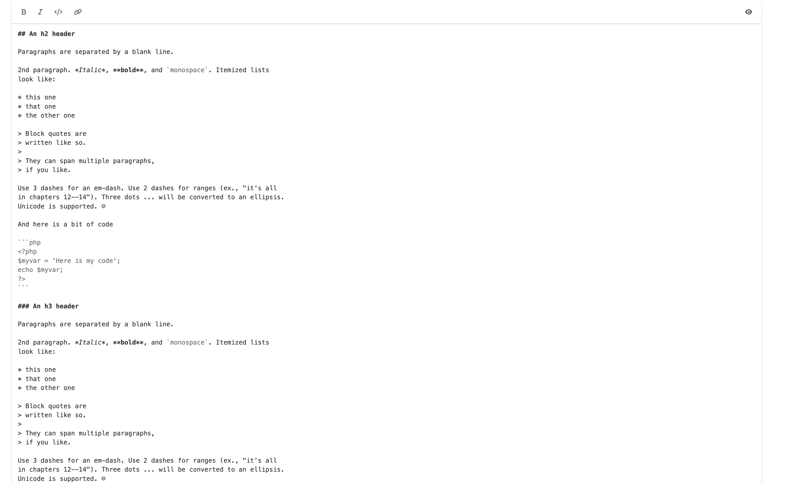
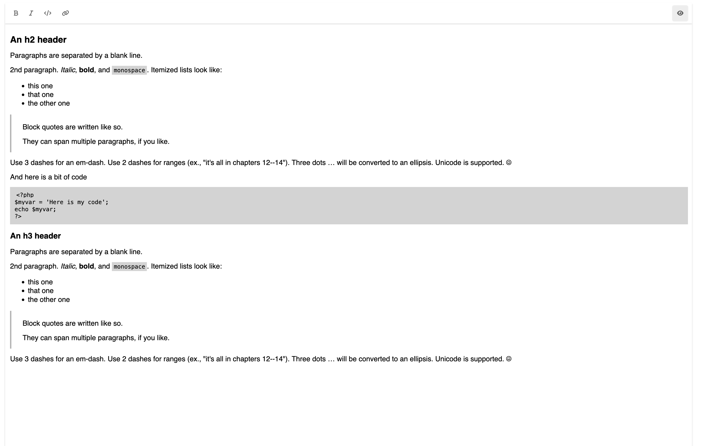

# Editor Markdown Js + Scss
Markdown editor, très simple à ajouter dans un projet comment laravel ou symfony ou autre. Avec une partie de preview,
pour le confort de la partie utilisateur.

## Dependencies:

- Codemirror 5 (editor)
- Showdown (preview)

## Demo:

### Editor

[](https://github.com/TheoMeunier/markdown-editor-js/blob/master/img/editor.png)

### Preview
[](https://github.com/TheoMeunier/markdown-editor-js/blob/master/img/preview.png)

## Add Action:
### Create button in toolbar
```html
<div class="icon" id="button">
    <!-- Icon Button action -->
</div>
```

### Define function in js
```js
const button = document.querySelector('#button');

if (button) {
    button.addEventListener('click', () => {
        // define function
    });
}
```